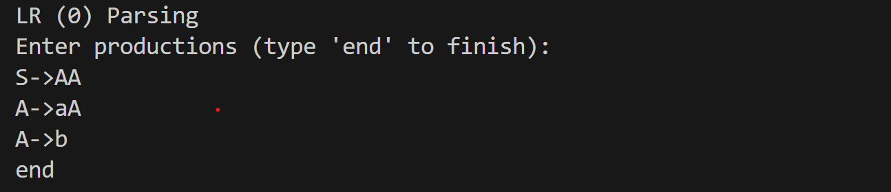
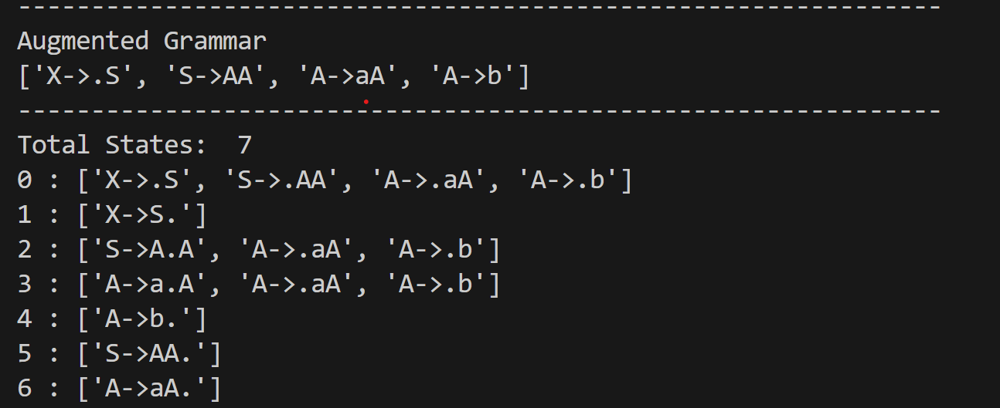
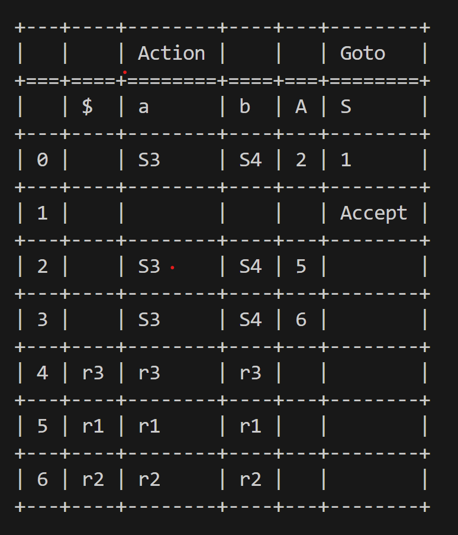
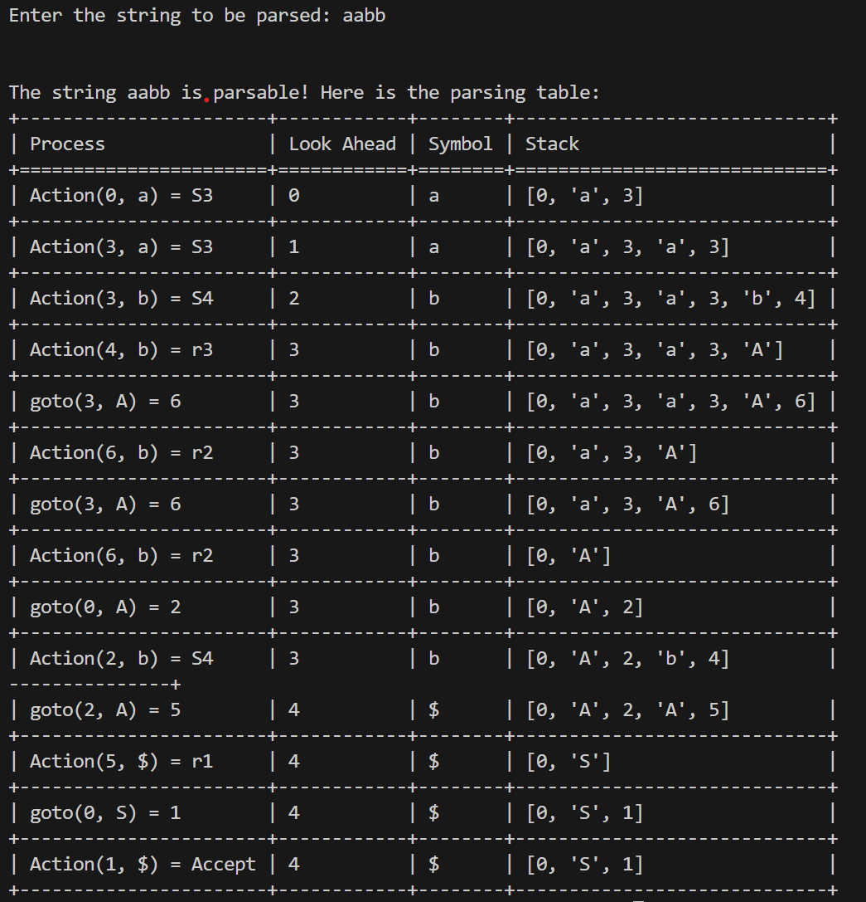

# LR(0) Parser

This repository contains a Python implementation of an LR(0) parser. The LR(0) parser is a type of bottom-up parser for analyzing context-free grammars used in compilers and interpreters.

## Features

- Computes the closure of a production
- Handles state transitions with the `goto` function
- Generates parsing tables for terminals and non-terminals
- Parses and validates input strings

## Installation

### Prerequisites

- Python 3.6 or higher (3.9.12 recommended)
- `termtables` library for displaying parsing tables
- 'collections' library for counting occurences

### Steps

1. **Clone the repository**:

    ```bash
    git clone https://github.com/yourusername/LR0-parser.git
    cd LR0-parser
    ```

2. **Install required packages**:

    ```bash
    pip install termtables
    pip install collections
    ```

## Usage

1. **Run the script**:

    ```bash
    python lr0_parser.py
    ```

2. **Enter productions**:
    You will be prompted to enter grammar productions one by one. Type `end` when you are done.

   

3. **View augmented grammar and states**:
    The script will display the augmented grammar and the generated states.

    

4. **Parsing table**:
    The parsing table will be displayed.

    

5. **Enter the string to be parsed**:

    ```plaintext
    Enter the string to be parsed: ccd
    ```

6. **Parsing result**:
    The script will display whether the string is parsable and provide the parsing table.

    
